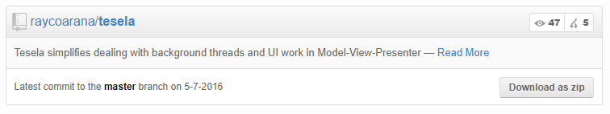

# jekyll-github-plugin
[](https://github.com/raycoarana/github-jekyll-plugin/actions/workflows/preintegration.yaml)
[](https://github.com/raycoarana/github-jekyll-plugin/releases/latest)

> 💎 Plug-in for jekyll to show a GitHub project in your pages.



## Install

Add the plug-in to your Jekyll site Gemfile plug-in group:

```
group :jekyll_plugins do
...
  gem "jekyll-github-plugin", "~> 1.0.1"
end
```

Copy the required assets to your assets directory:

```
/assets/css/github-styles.css
/assets/images/repo.png
/assets/images/stats.png
/assets/js/jquery.github.widget.js
```

Include in your template head file the following:

```html
<link rel='stylesheet' href='{{ "/assets/css/github-styles.css" | relative_url }}'>
<script src='{{ "/assets/js/jquery.github.widget.js" | relative_url }}'/>
```

## Development

```
make start	Start Jekyll plugin development server
make build	Build Jekyll plugin gem
make install	Install dependancies for Jekyll plugin development server
make push	Publish Jekyll plugin to rubygems
make clean	Clean build and development files
make deps	Install development tools
```
